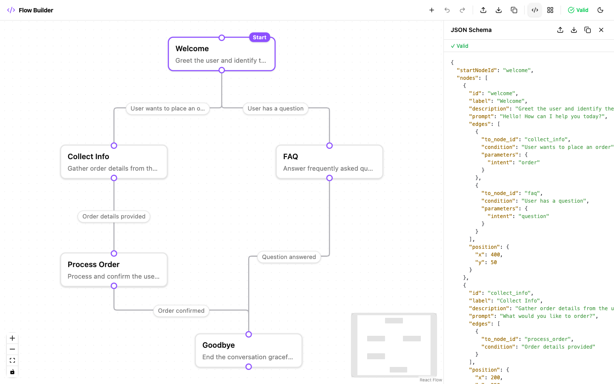
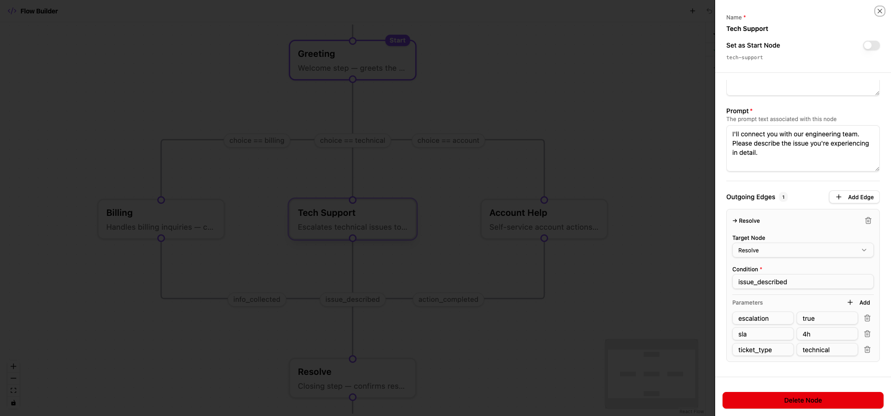
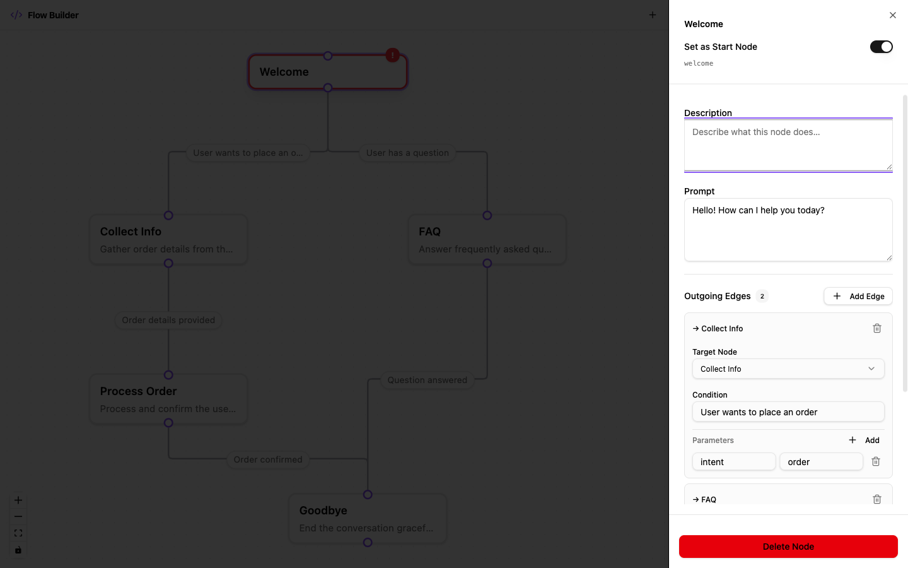
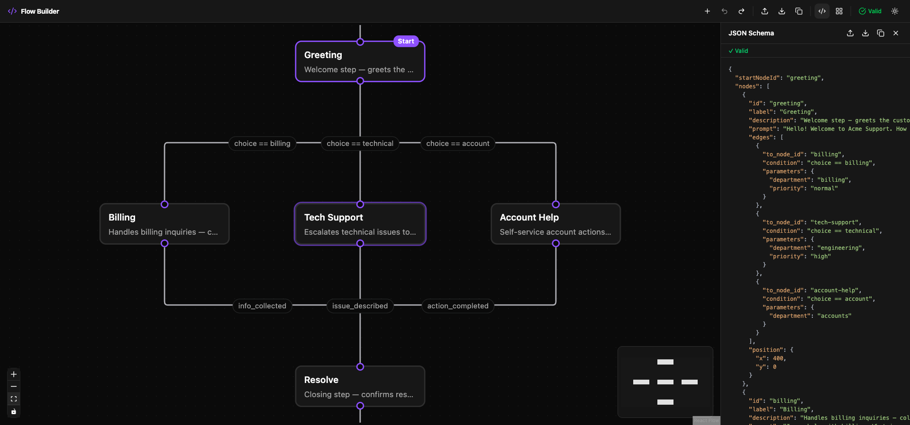

# Flow Builder

A single-page visual flow builder where users construct node-based workflows, connect them with conditional transitions, validate in real time, and export/import as JSON.

**Live demo:** [https://flow-builder-ruddy.vercel.app](https://flow-builder-ruddy.vercel.app)

## Screenshots

_Customer Support Chatbot — a real-life flow where each node carries a bot **prompt** (the message shown to the user) and each edge carries **parameters** (routing metadata like department, priority, SLA)._

|              Flow Canvas with JSON Preview               |                    Node Sidebar Editing                    |
| :------------------------------------------------------: | :--------------------------------------------------------: |
|  |  |

|                       Validation Errors                        |                   Dark Mode                    |
| :------------------------------------------------------------: | :--------------------------------------------: |
|  |  |

## Example Scenario

The screenshots above show a **Customer Support Chatbot** flow built entirely in the app:

| Node                   | Prompt (what the bot says)                                                   | Outgoing edges                                                                                          |
| ---------------------- | ---------------------------------------------------------------------------- | ------------------------------------------------------------------------------------------------------- |
| **Greeting** _(start)_ | "Hello! Welcome to Acme Support. How can I help you?"                        | `choice == billing` → Billing, `choice == technical` → Tech Support, `choice == account` → Account Help |
| **Billing**            | "What is your account number?"                                               | `info_collected` → Resolve                                                                              |
| **Tech Support**       | "Please describe the issue you're experiencing."                             | `issue_described` → Resolve                                                                             |
| **Account Help**       | "What would you like to do? Reset password / Update profile / Close account" | `action_completed` → Resolve                                                                            |
| **Resolve**            | "Your request has been processed! Anything else?"                            | `needs_more_help` → Greeting _(loop)_                                                                   |

Each edge carries **parameters** — key-value metadata consumed by a runtime engine:

- `department: "engineering"`, `priority: "high"` (route to the right team)
- `escalation: "true"`, `sla: "4h"` (set escalation policy)
- `ticket_type: "billing"`, `auto_close: "false"` (classify the ticket)

This demonstrates how `prompt` stores the bot's actual message at each step, and `parameters` carry operational metadata that a downstream runtime would use to execute the flow.

## Features

- **Canvas** — Add, drag, and delete nodes; connect them by drawing edges; visually mark a start node
- **Edge conditions** — Label each edge with a transition condition; edit inline on the canvas or in the sidebar
- **Node sidebar** — Click a node to edit its label, description, and prompt; manage outgoing edges (add/remove, pick target, write condition, key-value parameters)
- **JSON preview** — Live syntax-highlighted JSON that updates as you edit; copy to clipboard or download
- **Import** — Paste a JSON schema to reconstruct a flow on canvas with validation and error feedback
- **Real-time validation** — Unique IDs, required fields, valid start node, valid edge targets, disconnected-node warnings, self-loop detection; inline errors on every field
- **Undo / Redo** — Snapshot-based history (Cmd/Ctrl+Z, Cmd/Ctrl+Shift+Z)
- **Auto-layout** — Dagre-powered automatic node positioning
- **Dark mode** — System-aware toggle, persisted to localStorage
- **Keyboard shortcuts** — Delete/Backspace removes selection; Cmd/Ctrl+S downloads JSON; Escape closes sidebar

## Run Locally

Requires Node.js 20+ and npm 10+.

```bash
npm install
npm run dev        # http://localhost:5173
```

```bash
npm run build      # type-check + production build
npm run test       # 54 tests across 5 suites
```

## Design Choices

- **React Flow (`@xyflow/react`)** — Purpose-built for node-graph UIs. Handles drag, connect, pan/zoom, selection, and minimap out of the box, avoiding weeks of custom canvas work.
- **Zustand** — Single flat store with no Provider boilerplate. Direct `getState()` access lets toolbar actions (export, layout) read state without subscribing to every re-render.
- **Zod + DFS validation** — Structural schema checks (Zod) combined with graph-level reachability (DFS from start node) run after every mutation so the UI is always consistent with the current validation state.
- **Serialization boundary** — A dedicated layer (`toSchema` / `fromSchema`) separates React Flow's internal types (positions, selection flags) from the clean exported JSON schema, keeping import/export stable and the internal model flexible.
- **Immutable IDs + editable labels** — Auto-generated node IDs never change, so edge references stay valid. Users edit display labels freely without breaking the graph.
- **Tailwind CSS + shadcn/ui** — Utility-first styling with pre-built accessible Radix primitives. Minimal custom component code, consistent look.
